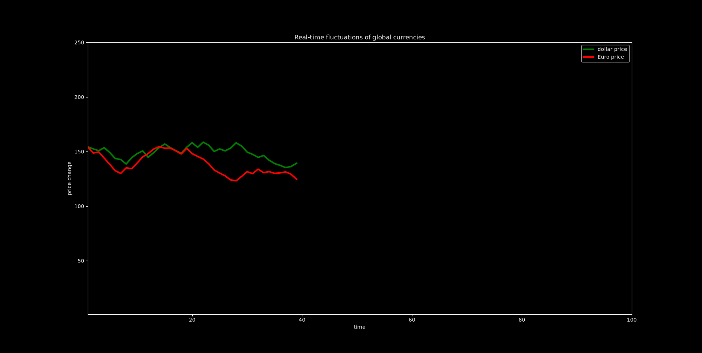
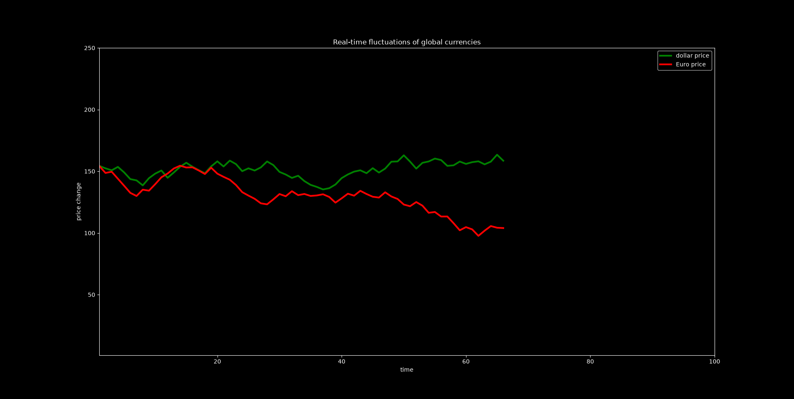
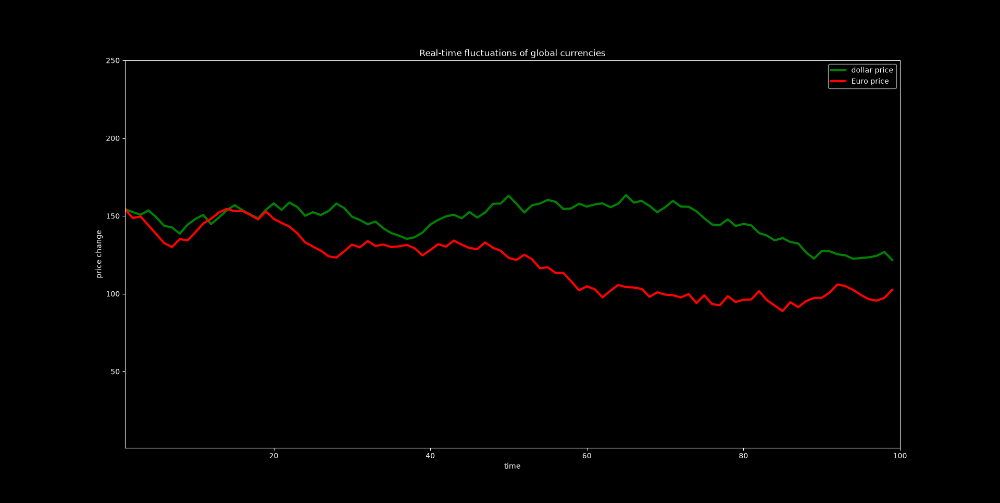

# Simulated-currency-changes-on-a-live-chart
A Python project with Matplotlib about simulated imaginary currency price changes on a LIVE chart.

## What does this project do?
- showing the imaginary currency price changes per second
- random Change the prices
- showing the prices in code editor terminal

## Technologies
- Python
- Matplotlib

## screenshots

Beginning of the LIVE chart:

Middle of the LIVE chart

End of the LIVE chart:

